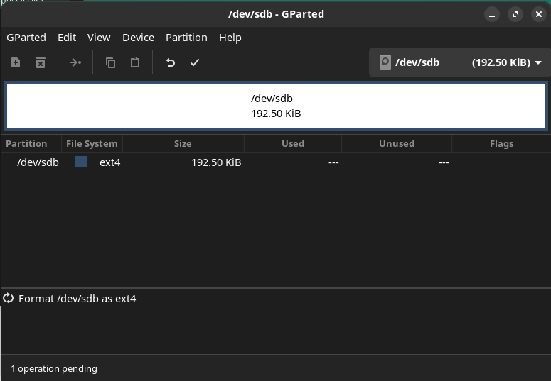

+++
title = "el dock de ugreen y la camara secreta :snake:"
date = 2023-11-23

[taxonomies]
tags = ["notas", "ugreen", "hmmm"]
+++
### Situacion

La "[Estacion de acoplamiento](https://es.aliexpress.com/item/1005005926386937.html)" en cuestion.

El problema es que tiene un storage secrerto de _197 KB_ donde tiene archivos de autorun y basura que no me dan ganas de instalar en ningun equipo.

```ls
Permissions Size User  Date Modified Name
drwxr-xr-x     - arkantos  6 dic  2022  'System Volume Information'
.rw-r--r--    46 arkantos  3 nov  2022  AUTORUN.INF
.r--r--r--   17k arkantos  3 dic  2022  logo.ico
.rw-r--r--    97 arkantos  2 nov  2022  'macOS Driver.url'
.rw-r--r--    99 arkantos  2 nov  2022  'Windows Driver.url'

```


### Goles ⚽🥅
- [X] Encontrar donde se monta en el sistema
- [X] Identificar el filesystem
- [ ] Nukear el volumen


### A vers 👀
En mi caso, con Manjaro tiene una herramienta gui para administrar discos `Disks` ahi dice que el contenido se monta en `/run/media/arkantos/84A6-2D72` y es el device `/dev/sdb`, ojo que es `FAT16` y es `Read-Only` por lo que intentar un `rm -rf` no servira de mucho.

```zsh
rm: cannot remove '84A6-2D72/System Volume Information/WPSettings.dat': Read-only file system
rm: cannot remove '84A6-2D72/System Volume Information/IndexerVolumeGuid': Read-only file system
rm: cannot remove '84A6-2D72/AUTORUN.INF': Read-only file system
rm: cannot remove '84A6-2D72/logo.ico': Read-only file system
rm: cannot remove '84A6-2D72/macOS Driver.url': Read-only file system
rm: cannot remove '84A6-2D72/Windows Driver.url': Read-only file system

```

Formatearlo con el mismo `Disks` es imposible, las opciones aparecen desactivadas (recuerda desmontar el volumen)

Para los volumenes asi de tercos, `Gparted` suele ser la solucion

Tomando en cuenta que sabemos que es `fat16` necesitamos un par de paquetes mas para poder manipular ese horrendo fs

`sudo pacman -S dosfstools mtools`



En teoria eso es necesario para formatear el volumen pero resulta en un error donde el device `/dev/sdb` es `read-only` 


[mount](https://stackoverflow.com/a/34848779) al rescate 

```zsh
$ sudo mount /dev/sdb -o remount,rw
mount: /run/media/arkantos/84A6-2D72: cannot remount /dev/sdb read-write, is write-protected.
       dmesg(1) may have more information after failed mount system call.
```

este ultimo mensaje tiene una nueva pista: `is write-protected.` es posible saltarse esa proteccion?


### Result

TBD...